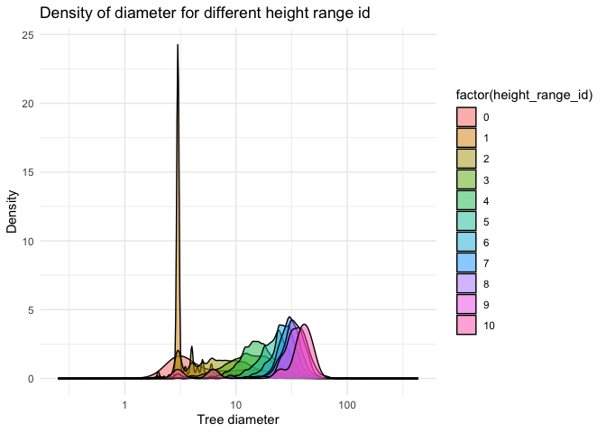
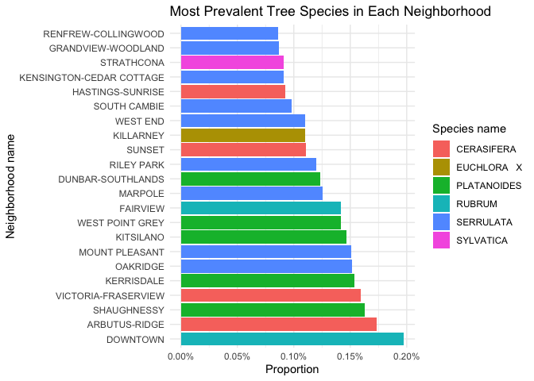
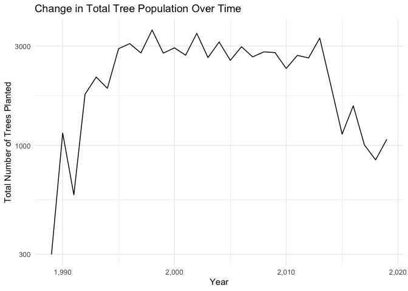
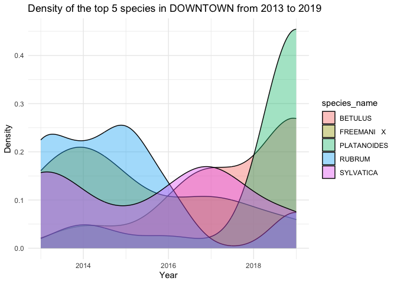

Mini Data Analysis Milestone 2
================

*To complete this milestone, you can either edit [this `.rmd`
file](https://raw.githubusercontent.com/UBC-STAT/stat545.stat.ubc.ca/master/content/mini-project/mini-project-2.Rmd)
directly. Fill in the sections that are commented out with
`<!--- start your work here--->`. When you are done, make sure to knit
to an `.md` file by changing the output in the YAML header to
`github_document`, before submitting a tagged release on canvas.*

# Welcome to the rest of your mini data analysis project!

In Milestone 1, you explored your data. and came up with research
questions. This time, we will finish up our mini data analysis and
obtain results for your data by:

- Making summary tables and graphs
- Manipulating special data types in R: factors and/or dates and times.
- Fitting a model object to your data, and extract a result.
- Reading and writing data as separate files.

We will also explore more in depth the concept of *tidy data.*

**NOTE**: The main purpose of the mini data analysis is to integrate
what you learn in class in an analysis. Although each milestone provides
a framework for you to conduct your analysis, it’s possible that you
might find the instructions too rigid for your data set. If this is the
case, you may deviate from the instructions – just make sure you’re
demonstrating a wide range of tools and techniques taught in this class.

# Instructions

**To complete this milestone**, edit [this very `.Rmd`
file](https://raw.githubusercontent.com/UBC-STAT/stat545.stat.ubc.ca/master/content/mini-project/mini-project-2.Rmd)
directly. Fill in the sections that are tagged with
`<!--- start your work here--->`.

**To submit this milestone**, make sure to knit this `.Rmd` file to an
`.md` file by changing the YAML output settings from
`output: html_document` to `output: github_document`. Commit and push
all of your work to your mini-analysis GitHub repository, and tag a
release on GitHub. Then, submit a link to your tagged release on canvas.

**Points**: This milestone is worth 50 points: 45 for your analysis, and
5 for overall reproducibility, cleanliness, and coherence of the Github
submission.

**Research Questions**: In Milestone 1, you chose two research questions
to focus on. Wherever realistic, your work in this milestone should
relate to these research questions whenever we ask for justification
behind your work. In the case that some tasks in this milestone don’t
align well with one of your research questions, feel free to discuss
your results in the context of a different research question.

# Learning Objectives

By the end of this milestone, you should:

- Understand what *tidy* data is, and how to create it using `tidyr`.
- Generate a reproducible and clear report using R Markdown.
- Manipulating special data types in R: factors and/or dates and times.
- Fitting a model object to your data, and extract a result.
- Reading and writing data as separate files.

# Setup

Begin by loading your data and the tidyverse package below:

``` r
library(datateachr) # <- might contain the data you picked!
library(tidyverse)
```

# Task 1: Process and summarize your data

From milestone 1, you should have an idea of the basic structure of your
dataset (e.g. number of rows and columns, class types, etc.). Here, we
will start investigating your data more in-depth using various data
manipulation functions.

### 1.1 (1 point)

First, write out the 4 research questions you defined in milestone 1
were. This will guide your work through milestone 2:

<!-------------------------- Start your work below ---------------------------->

**Research Question 1:** What is the relationship between the diameter
and their height_range_id in the dataset?

**Research Question 2:** Are certain tree species more prevalent in
specific neighborhoods of Vancouver? In other words, are there any
relationships between species_name and neighborhood_name?

**Research Question 3:** What is the change of tree population in
Vancouver changed over time? In other words, the change in the amount of
trees planted each year. (Here, I added a sentence to make the research
question more clear to understand.)

**Research Question 4:** What is a change in the tree density of the top
5 most popular tree species in the DOWNTOWN area from 2013 to 2019?
(This is a newly added question to replace the original research
question 1, which is “How does the diameter of trees vary with the
corresponding latitude or longitude coordinates in the dataset?” The
generated scatter plot of the original Research Question 1 does not seem
to yield pretty useful results in terms of the relationship between tree
diameter and the corresponding latitude or longitude. Based on the
generated graphs, there is no obvious sign that certain longitude or
latitude will largely affect the diameter of the trees.)
<!----------------------------------------------------------------------------->

Here, we will investigate your data using various data manipulation and
graphing functions.

### 1.2 (8 points)

Now, for each of your four research questions, choose one task from
options 1-4 (summarizing), and one other task from 4-8 (graphing). You
should have 2 tasks done for each research question (8 total). Make sure
it makes sense to do them! (e.g. don’t use a numerical variables for a
task that needs a categorical variable.). Comment on why each task helps
(or doesn’t!) answer the corresponding research question.

Ensure that the output of each operation is printed!

Also make sure that you’re using dplyr and ggplot2 rather than base R.
Outside of this project, you may find that you prefer using base R
functions for certain tasks, and that’s just fine! But part of this
project is for you to practice the tools we learned in class, which is
dplyr and ggplot2.

**Summarizing:**

1.  Compute the *range*, *mean*, and *two other summary statistics* of
    **one numerical variable** across the groups of **one categorical
    variable** from your data.
2.  Compute the number of observations for at least one of your
    categorical variables. Do not use the function `table()`!
3.  Create a categorical variable with 3 or more groups from an existing
    numerical variable. You can use this new variable in the other
    tasks! *An example: age in years into “child, teen, adult, senior”.*
4.  Compute the proportion and counts in each category of one
    categorical variable across the groups of another categorical
    variable from your data. Do not use the function `table()`!

**Graphing:**

6.  Create a graph of your choosing, make one of the axes logarithmic,
    and format the axes labels so that they are “pretty” or easier to
    read.
7.  Make a graph where it makes sense to customize the alpha
    transparency.

Using variables and/or tables you made in one of the “Summarizing”
tasks:

8.  Create a graph that has at least two geom layers.
9.  Create 3 histograms, with each histogram having different sized
    bins. Pick the “best” one and explain why it is the best.

Make sure it’s clear what research question you are doing each operation
for!

<!------------------------- Start your work below ----------------------------->

**Research Question 1:** What is the relationship between the diameter
and their height_range_id in the dataset?

**Option1 (summarizing)** I compute the *range*, *mean*, and *median*
and *std* of the diameter across the groups of height_range_id from the
data. Based on the diameter_summary tibble, it seems there is a positive
relationship between height_range_id and diameter_mean and
diameter_median. This information indicates that a tree with a larger
height_range_id tends to have a larger diameter.

``` r
diameter_summary<- vancouver_trees %>%
  group_by(height_range_id) %>%
  summarize(
    # compute range
    d_range = diff(range(diameter, na.rm = TRUE)),
    # compute mean
    d_mean = mean(diameter, na.rm = TRUE),
    # compute median
    d_median = median(diameter, na.rm = TRUE),
    #compute std
    d_std = sd(diameter, na.rm = TRUE)
  )
print(diameter_summary)
```

    ## # A tibble: 11 × 5
    ##    height_range_id d_range d_mean d_median d_std
    ##              <dbl>   <dbl>  <dbl>    <dbl> <dbl>
    ##  1               0    55     5.41      3    8.11
    ##  2               1    86     3.92      3    2.28
    ##  3               2   435     8.38      7    5.99
    ##  4               3   141    14.6      13    7.60
    ##  5               4   316    16.6      15.5  7.03
    ##  6               5    98    22.8      22.5  7.16
    ##  7               6    99    27.3      27    7.11
    ##  8               7    72.5  30.8      30    7.46
    ##  9               8    96    33.3      33    8.27
    ## 10               9    65    34.8      35    9.69
    ## 11              10    47    34.1      39   15.3

**Option7 (graphing)** I graphed a density plot for diameter versus
height_range_id, the different height_range_id are shown as fills. The
alpha value is customed to be 0.5 since the transparency matters here.
Based on the density plot generated below, we can see a clear
relationship between the density and diameter of the trees as well as
the height_range_id. It seems like for most cases, as the tree diameter
increases, the density of the tree increases as well. Meanwhile, it
seems like there is also a positive relationship between the tree
diameter and the height_range_id. When the tree diameter is larger, the
corresponding height_range_id is also larger. I compute the *range*,
*mean*, and *median* and *std* of the diameter across the groups of
height_range_id from the data. Based on the diameter_summary tibble, it
seems there is a positive relationship between height_range_id and
diameter_mean and diameter_median. This information indicates that a
tree with a larger height_range_id tends to have a larger diameter.

``` r
filtered_dataset <- vancouver_trees %>%
  # filter out the diameter > 0
  filter(diameter > 0)

# create a density plot for diameter versus height_range_id
ggplot(data = filtered_dataset, aes(x = diameter)) +
  # customized the alpha value
  geom_density(aes(fill = factor(height_range_id)), alpha = 0.5) +
  labs(
    title = "Density of diameter for different height range id",
    x = "Tree diameter",
    y = "Density"
  ) + scale_x_log10() + theme_minimal()
```

<!-- -->

**Research Question 2:** Are certain tree species more prevalent in
specific neighborhoods of Vancouver? In other words, are there any
relationships between species_name and neighborhood_name?

**Option4 (summarizing)** I compute the proportion and total_counts in
each category of neighbourhood_name across the groups of species_name
from the dataset in a tibble called species_in_neighborhood. With this
tibble, I know the total and proportion of each species in the
corresponding neighborhood, which is useful for the analysis of my
research question.

``` r
species_in_neighborhood <- vancouver_trees %>%
  count(neighbourhood_name, species_name) %>%
  group_by(neighbourhood_name) %>%
  # add column total_count and proportion
  mutate(total_count = sum(n),proportion = n / total_count) %>%
  # set tibble to original state
  ungroup()

head(species_in_neighborhood)
```

    ## # A tibble: 6 × 5
    ##   neighbourhood_name species_name       n total_count proportion
    ##   <chr>              <chr>          <int>       <int>      <dbl>
    ## 1 ARBUTUS-RIDGE      ABIES              2        5169   0.000387
    ## 2 ARBUTUS-RIDGE      ACERIFOLIA   X   103        5169   0.0199  
    ## 3 ARBUTUS-RIDGE      ACUTISSIMA         5        5169   0.000967
    ## 4 ARBUTUS-RIDGE      ALNIFOLIA         16        5169   0.00310 
    ## 5 ARBUTUS-RIDGE      AMERICANA        225        5169   0.0435  
    ## 6 ARBUTUS-RIDGE      AQUIFOLIUM         3        5169   0.000580

**Option6 (graphing)** I get the most popular species from the above
tibble. Then I create a graph of the most prevalent tree species in each
neighborhood, x-axis is the proportion and is made logarithmic, y-axis
is the neighborhood name. Species_name is the fill. Based on the plot
generated, it seems like DOWNTOWN has obvious favors over Rubrum, as
well as the FAIRVIEW. STRATHCONA seems to be the only neighborhood that
favors the SYLVATICA. PLATANOIDES and SERRULATA seem to be the favorite
tree species for most neighborhood districts.

``` r
most_popular_species <- species_in_neighborhood %>%
  group_by(neighbourhood_name) %>%
  # get the most popular species
  slice_max(order_by = proportion)

 # in order to see the full tibble
options(dplyr.print_min = 100) 
print(most_popular_species)
```

    ## # A tibble: 22 × 5
    ## # Groups:   neighbourhood_name [22]
    ##    neighbourhood_name       species_name     n total_count proportion
    ##    <chr>                    <chr>        <int>       <int>      <dbl>
    ##  1 ARBUTUS-RIDGE            CERASIFERA     895        5169     0.173 
    ##  2 DOWNTOWN                 RUBRUM        1019        5159     0.198 
    ##  3 DUNBAR-SOUTHLANDS        PLATANOIDES   1165        9415     0.124 
    ##  4 FAIRVIEW                 RUBRUM         567        4002     0.142 
    ##  5 GRANDVIEW-WOODLAND       SERRULATA      583        6703     0.0870
    ##  6 HASTINGS-SUNRISE         CERASIFERA     972       10547     0.0922
    ##  7 KENSINGTON-CEDAR COTTAGE SERRULATA     1002       11042     0.0907
    ##  8 KERRISDALE               PLATANOIDES   1067        6936     0.154 
    ##  9 KILLARNEY                EUCHLORA   X   676        6148     0.110 
    ## 10 KITSILANO                PLATANOIDES   1188        8115     0.146 
    ## 11 MARPOLE                  SERRULATA      799        6353     0.126 
    ## 12 MOUNT PLEASANT           SERRULATA      948        6292     0.151 
    ## 13 OAKRIDGE                 SERRULATA      726        4796     0.151 
    ## 14 RENFREW-COLLINGWOOD      SERRULATA      980       11386     0.0861
    ## 15 RILEY PARK               SERRULATA      822        6870     0.120 
    ## 16 SHAUGHNESSY              PLATANOIDES   1139        7009     0.163 
    ## 17 SOUTH CAMBIE             SERRULATA      329        3343     0.0984
    ## 18 STRATHCONA               SYLVATICA      247        2724     0.0907
    ## 19 SUNSET                   CERASIFERA     928        8367     0.111 
    ## 20 VICTORIA-FRASERVIEW      CERASIFERA    1241        7789     0.159 
    ## 21 WEST END                 SERRULATA      385        3507     0.110 
    ## 22 WEST POINT GREY          PLATANOIDES    700        4939     0.142

``` r
ggplot(most_popular_species, aes(x = proportion, y = reorder(neighbourhood_name, -proportion), fill = species_name))+
  geom_bar(stat = "identity") +
  labs(
    title = "Most Prevalent Tree Species in Each Neighborhood",
    x = "Proportion",
    y = "Neighborhood name",
    fill = "Species name") + 
  # scale the x axis to log
  scale_x_log10() + 
  theme_minimal()+ 
  # format the labels as percentages
  scale_x_continuous(labels = scales::percent_format(scale = 1))
```

    ## Scale for x is already present.
    ## Adding another scale for x, which will replace the existing scale.

<!-- -->

**Research Question 3:** What is the change of tree population in
Vancouver changed over time? In other words, the change in the amount of
trees planted each year.

Since the two variables in this research question are date_planted
(date) and the total number of trees(numerical), it is quite difficult
to choose one summary task since all four somehow relate to categorical
variables except option 3. In order to make the data analysis close to
my research question, I chose to create a categorical variable
year_range with 4 groups from the date variable based on extracting the
year information from the date variable instead of a numerical variable.

**Option3 (summarizing)**

``` r
vancouver_trees <- vancouver_trees %>%
  #split year into 4 categories
  mutate(year_range = case_when( 
    year(date_planted) < 2000 ~ "Before 2000",
    year(date_planted) >= 2000 & year(date_planted) <= 2010 ~ "2000-2010",
    year(date_planted) > 2010 & year(date_planted) <= 2020 ~ "2010-2020",
    TRUE ~ "After 2020"
  ))
glimpse(vancouver_trees)
```

    ## Rows: 146,611
    ## Columns: 21
    ## $ tree_id            <dbl> 149556, 149563, 149579, 149590, 149604, 149616, 149…
    ## $ civic_number       <dbl> 494, 450, 4994, 858, 5032, 585, 4909, 4925, 4969, 7…
    ## $ std_street         <chr> "W 58TH AV", "W 58TH AV", "WINDSOR ST", "E 39TH AV"…
    ## $ genus_name         <chr> "ULMUS", "ZELKOVA", "STYRAX", "FRAXINUS", "ACER", "…
    ## $ species_name       <chr> "AMERICANA", "SERRATA", "JAPONICA", "AMERICANA", "C…
    ## $ cultivar_name      <chr> "BRANDON", NA, NA, "AUTUMN APPLAUSE", NA, "CHANTICL…
    ## $ common_name        <chr> "BRANDON ELM", "JAPANESE ZELKOVA", "JAPANESE SNOWBE…
    ## $ assigned           <chr> "N", "N", "N", "Y", "N", "N", "N", "N", "N", "N", "…
    ## $ root_barrier       <chr> "N", "N", "N", "N", "N", "N", "N", "N", "N", "N", "…
    ## $ plant_area         <chr> "N", "N", "4", "4", "4", "B", "6", "6", "3", "3", "…
    ## $ on_street_block    <dbl> 400, 400, 4900, 800, 5000, 500, 4900, 4900, 4900, 7…
    ## $ on_street          <chr> "W 58TH AV", "W 58TH AV", "WINDSOR ST", "E 39TH AV"…
    ## $ neighbourhood_name <chr> "MARPOLE", "MARPOLE", "KENSINGTON-CEDAR COTTAGE", "…
    ## $ street_side_name   <chr> "EVEN", "EVEN", "EVEN", "EVEN", "EVEN", "ODD", "ODD…
    ## $ height_range_id    <dbl> 2, 4, 3, 4, 2, 2, 3, 3, 2, 2, 2, 5, 3, 2, 2, 2, 2, …
    ## $ diameter           <dbl> 10.00, 10.00, 4.00, 18.00, 9.00, 5.00, 15.00, 14.00…
    ## $ curb               <chr> "N", "N", "Y", "Y", "Y", "Y", "Y", "Y", "Y", "Y", "…
    ## $ date_planted       <date> 1999-01-13, 1996-05-31, 1993-11-22, 1996-04-29, 19…
    ## $ longitude          <dbl> -123.1161, -123.1147, -123.0846, -123.0870, -123.08…
    ## $ latitude           <dbl> 49.21776, 49.21776, 49.23938, 49.23469, 49.23894, 4…
    ## $ year_range         <chr> "Before 2000", "Before 2000", "Before 2000", "Befor…

``` r
vancouver_trees <-vancouver_trees %>%
  #create a new col year_planted through the data variable
  mutate(year_planted = year(date_planted))

# group the data by year 
tree_counts_by_year <- vancouver_trees %>%
  group_by(year_planted) %>%
  
  #count the total number of trees planted each year
  summarise(total_tree_count = n()) %>%
  # set tibble to original state
  ungroup()
print(tree_counts_by_year)
```

    ## # A tibble: 32 × 2
    ##    year_planted total_tree_count
    ##           <dbl>            <int>
    ##  1         1989              300
    ##  2         1990             1145
    ##  3         1991              579
    ##  4         1992             1759
    ##  5         1993             2128
    ##  6         1994             1879
    ##  7         1995             2912
    ##  8         1996             3079
    ##  9         1997             2778
    ## 10         1998             3581
    ## 11         1999             2772
    ## 12         2000             2938
    ## 13         2001             2710
    ## 14         2002             3447
    ## 15         2003             2640
    ## 16         2004             3135
    ## 17         2005             2560
    ## 18         2006             2975
    ## 19         2007             2659
    ## 20         2008             2812
    ## 21         2009             2788
    ## 22         2010             2339
    ## 23         2011             2705
    ## 24         2012             2628
    ## 25         2013             3273
    ## 26         2014             1936
    ## 27         2015             1132
    ## 28         2016             1549
    ## 29         2017             1004
    ## 30         2018              852
    ## 31         2019             1069
    ## 32           NA            76548

**Option6 (graphing)** Create a graph of the total Number of trees
planted over years, y-axes is made logarithmic (total number of tree
planted), and format the axes labels.

``` r
# visualize the change in the amount of trees over years
ggplot(tree_counts_by_year, aes(x = year_planted, y = total_tree_count)) +
  geom_line() +
  # Set the y-axis to be logarithmic
  scale_y_log10() + 
  labs(
    title = "Change in Total Tree Population Over Time",
    x = "Year",
    y = "Total Number of Trees Planted"
  ) +
  theme_minimal() +
  scale_x_continuous(labels = scales::comma)
```

    ## Warning: Removed 1 row containing missing values (`geom_line()`).

<!-- -->

**Research Question 4:** What is a change in the tree density of the top
5 most popular tree species in DOWNTOWN area from 2013 to 2019?

**Option2 (summarizing)** I calculate the number of observations for one
of the categorical variables, neighborhood_name, and store it as
neighbourhood_count. Since this research question is about the tree
density of the top 5 most popular tree species in the DOWNTOWN area, it
is useful to get a tibble that contains the total amount of trees
planted for each neighborhood, which contains the information of
DOWNTOWN. Based on the output tibble, it seems like a large of amount of
trees were planted in the RENFREW-COLLINGWOOD, KENSINGTON-CEDAR COTTAGE,
and HASTINGS-SUNRISE neighborhoods. DOWNTOWN has a round 5000, which is
not bad.

``` r
# calculate the number of observations for each neighbourhood
neighbourhood_count<- vancouver_trees %>%
  group_by(neighbourhood_name) %>%
  # get the number of tree planted in each neighborhood
  summarise(observations = n()) %>%
  # set tibble to original state
  ungroup()

print(neighbourhood_count)
```

    ## # A tibble: 22 × 2
    ##    neighbourhood_name       observations
    ##    <chr>                           <int>
    ##  1 ARBUTUS-RIDGE                    5169
    ##  2 DOWNTOWN                         5159
    ##  3 DUNBAR-SOUTHLANDS                9415
    ##  4 FAIRVIEW                         4002
    ##  5 GRANDVIEW-WOODLAND               6703
    ##  6 HASTINGS-SUNRISE                10547
    ##  7 KENSINGTON-CEDAR COTTAGE        11042
    ##  8 KERRISDALE                       6936
    ##  9 KILLARNEY                        6148
    ## 10 KITSILANO                        8115
    ## 11 MARPOLE                          6353
    ## 12 MOUNT PLEASANT                   6292
    ## 13 OAKRIDGE                         4796
    ## 14 RENFREW-COLLINGWOOD             11386
    ## 15 RILEY PARK                       6870
    ## 16 SHAUGHNESSY                      7009
    ## 17 SOUTH CAMBIE                     3343
    ## 18 STRATHCONA                       2724
    ## 19 SUNSET                           8367
    ## 20 VICTORIA-FRASERVIEW              7789
    ## 21 WEST END                         3507
    ## 22 WEST POINT GREY                  4939

**Option7 (graphing)** In order to further analyze the research
question, I chose to filter out the DOWNTOWN area among all the
neighborhoods, and I picked out the top 5 popular tree species based on
the n variable for each species. Top 5 tree species in DOWNTOWN are
“RUBRUM”, “PLATANOIDES”, “FREEMANI X”, “SYLVATICA”, “BETULUS”
respectively.

``` r
# find the top 5 most popular species in downtown first
# species_in_neighborhood tibble was created above
species_in_downtown <- species_in_neighborhood %>%
  filter(neighbourhood_name == "DOWNTOWN") 
  
print(species_in_downtown)
```

    ## # A tibble: 79 × 5
    ##    neighbourhood_name species_name       n total_count proportion
    ##    <chr>              <chr>          <int>       <int>      <dbl>
    ##  1 DOWNTOWN           ABIES              1        5159   0.000194
    ##  2 DOWNTOWN           ACERIFOLIA   X   123        5159   0.0238  
    ##  3 DOWNTOWN           ACUTISSIMA        67        5159   0.0130  
    ##  4 DOWNTOWN           ALNIFOLIA          3        5159   0.000582
    ##  5 DOWNTOWN           AMERICANA         50        5159   0.00969 
    ##  6 DOWNTOWN           ARIA               3        5159   0.000582
    ##  7 DOWNTOWN           AUCUPARIA          7        5159   0.00136 
    ##  8 DOWNTOWN           BACCATA            1        5159   0.000194
    ##  9 DOWNTOWN           BETULUS          289        5159   0.0560  
    ## 10 DOWNTOWN           BILOBA            68        5159   0.0132  
    ## 11 DOWNTOWN           CALLERYANA       122        5159   0.0236  
    ## 12 DOWNTOWN           CAMPESTRE        147        5159   0.0285  
    ## 13 DOWNTOWN           CAPPADOCICUM      21        5159   0.00407 
    ## 14 DOWNTOWN           CAROLINIANA        4        5159   0.000775
    ## 15 DOWNTOWN           CERASIFERA         3        5159   0.000582
    ## 16 DOWNTOWN           CHINENSE          67        5159   0.0130  
    ## 17 DOWNTOWN           COCCINEA         109        5159   0.0211  
    ## 18 DOWNTOWN           CORDATA           60        5159   0.0116  
    ## 19 DOWNTOWN           DECURRENS          3        5159   0.000582
    ## 20 DOWNTOWN           DENUDATA           2        5159   0.000388
    ## 21 DOWNTOWN           EUCHLORA   X     155        5159   0.0300  
    ## 22 DOWNTOWN           EXCELSIOR         24        5159   0.00465 
    ## 23 DOWNTOWN           FLEXILUS           2        5159   0.000388
    ## 24 DOWNTOWN           FLORIBUNDA         4        5159   0.000775
    ## 25 DOWNTOWN           FLORIDA            1        5159   0.000194
    ## 26 DOWNTOWN           FORTUNEI           7        5159   0.00136 
    ## 27 DOWNTOWN           FRAINETTO          9        5159   0.00174 
    ## 28 DOWNTOWN           FREEMANI   X     329        5159   0.0638  
    ## 29 DOWNTOWN           GIGANTEUM          3        5159   0.000582
    ## 30 DOWNTOWN           GRANDIFOLIA        2        5159   0.000388
    ## 31 DOWNTOWN           GRISEUM            6        5159   0.00116 
    ## 32 DOWNTOWN           HIPPOCASTANUM     16        5159   0.00310 
    ## 33 DOWNTOWN           JAPONICA          41        5159   0.00795 
    ## 34 DOWNTOWN           JAPONICUM         54        5159   0.0105  
    ## 35 DOWNTOWN           KEWENSIS X         4        5159   0.000775
    ## 36 DOWNTOWN           KOBUS             56        5159   0.0109  
    ## 37 DOWNTOWN           KOUSA              7        5159   0.00136 
    ## 38 DOWNTOWN           LAVALLEI  X       29        5159   0.00562 
    ## 39 DOWNTOWN           LAWSONIANA         4        5159   0.000775
    ## 40 DOWNTOWN           MACROPHYLLUM       1        5159   0.000194
    ## 41 DOWNTOWN           MENZIESII          1        5159   0.000194
    ## 42 DOWNTOWN           MORDENSIS          5        5159   0.000969
    ## 43 DOWNTOWN           NEGUNDO            1        5159   0.000194
    ## 44 DOWNTOWN           OMORIKA            2        5159   0.000388
    ## 45 DOWNTOWN           ORIENTALIS         1        5159   0.000194
    ## 46 DOWNTOWN           ORNUS             18        5159   0.00349 
    ## 47 DOWNTOWN           OXYCARPA           3        5159   0.000582
    ## 48 DOWNTOWN           PALMATUM           6        5159   0.00116 
    ## 49 DOWNTOWN           PALUSTRIS        164        5159   0.0318  
    ## 50 DOWNTOWN           PENDULA           12        5159   0.00233 
    ## 51 DOWNTOWN           PENNSYLVANICA      4        5159   0.000775
    ## 52 DOWNTOWN           PENNSYLVANICUM     3        5159   0.000582
    ## 53 DOWNTOWN           PERSICA           88        5159   0.0171  
    ## 54 DOWNTOWN           PHELLOS            8        5159   0.00155 
    ## 55 DOWNTOWN           PLATANOIDES      348        5159   0.0675  
    ## 56 DOWNTOWN           PLICATA            4        5159   0.000775
    ## 57 DOWNTOWN           PSEUDOACACIA      11        5159   0.00213 
    ## 58 DOWNTOWN           PSEUDOCAMELLIA     4        5159   0.000775
    ## 59 DOWNTOWN           PSEUDOPLATANUS     4        5159   0.000775
    ## 60 DOWNTOWN           RETICULATA        13        5159   0.00252 
    ## 61 DOWNTOWN           ROBUR             32        5159   0.00620 
    ## 62 DOWNTOWN           ROBUR X ALBA       1        5159   0.000194
    ## 63 DOWNTOWN           RUBRA             78        5159   0.0151  
    ## 64 DOWNTOWN           RUBRUM          1019        5159   0.198   
    ## 65 DOWNTOWN           SACCHARINUM       23        5159   0.00446 
    ## 66 DOWNTOWN           SACCHARUM          2        5159   0.000388
    ## 67 DOWNTOWN           SARGENTII         50        5159   0.00969 
    ## 68 DOWNTOWN           SERRULATA        106        5159   0.0205  
    ## 69 DOWNTOWN           SHUMARDII         65        5159   0.0126  
    ## 70 DOWNTOWN           SPECIES          114        5159   0.0221  
    ## 71 DOWNTOWN           STYRACIFLUA      174        5159   0.0337  
    ## 72 DOWNTOWN           SUBHIRTELLA        3        5159   0.000582
    ## 73 DOWNTOWN           SYLVATICA        456        5159   0.0884  
    ## 74 DOWNTOWN           TRIACANTHOS      125        5159   0.0242  
    ## 75 DOWNTOWN           TRUNCATUM         84        5159   0.0163  
    ## 76 DOWNTOWN           TULIPIFERA       184        5159   0.0357  
    ## 77 DOWNTOWN           VELUTINA           6        5159   0.00116 
    ## 78 DOWNTOWN           X YEDOENSIS        8        5159   0.00155 
    ## 79 DOWNTOWN           XX                25        5159   0.00485

Therefore, I can graph the density plot of the top 5 most popular tree
species in the DOWNTOWN area from 2013 to 2019. I adjust the alpha value
to 0.4 since transparency matters here. With a smaller alpha value, I am
able to see the change in the amount of trees planted over these years
for different tree species. Based on the generated plot, it seems like
the DOWNTOWN area started to plant a large amount of “PLATANOIDES” in
2017, whereas the amount of “RUBRUM” planted started to drop. The
overall trend of planting “BETULUS” was also an up-trend and the overall
trend of “FREEMANI X” was a down-trend. It might be due to the change in
climate conditions so that certain tree species would become more
popular in certain districts.

``` r
# filter the dataset for the downtown neighborhood and the top 5 popular species
downtown_species <- vancouver_trees %>%
  filter(neighbourhood_name == "DOWNTOWN" & 
         year_planted >= 2013 & year_planted <= 2019 & 
         species_name %in% c("RUBRUM", "PLATANOIDES","FREEMANI   X", "SYLVATICA", "BETULUS"))

# create a density plot with personalized alpha value
ggplot(data = downtown_species, aes(x = year_planted, fill = species_name)) +
  geom_density(alpha = 0.4) +
  labs(
    title = "Density of the top 5 species in DOWNTOWN from 2013 to 2019",
    x = "Year",
    y = "Density"
  ) + 
  theme_minimal()
```

<!-- -->
<!----------------------------------------------------------------------------->

### 1.3 (2 points)

Based on the operations that you’ve completed, how much closer are you
to answering your research questions? Think about what aspects of your
research questions remain unclear. Can your research questions be
refined, now that you’ve investigated your data a bit more? Which
research questions are yielding interesting results?

<!------------------------- Write your answer here ---------------------------->

Based on the above operations, I think my data analysis outputs relevant
results to all the research questions. Research Question 1 is yielding
useful results, it shows a positive relationship between height_range_id
diameter_mean and diameter_median. This information indicates that a
tree with a larger height_range_id tends to have a larger diameter. The
generated further proved this result.

Meanwhile, Research Question 2 yields interesting results. Based on the
generated plot, it is clear to see that each neighborhood has its
favorite tree species. For example, downtown favors Rubrum the most, the
proportion is almost 20% in the downtown area. Fairview also plants this
kind of tree the most, occupying about 14% of the trees in that
neighborhood. STRATHCONA seems to be the only neighborhood that favors
the SYLVATICA tree species. PLATANOIDES and SERRULATA look like the
favorite tree species for most neighborhood districts.

At the same time, Research Question 3 is yielding meaningful results. I
plotted the total amount of trees planted over the years. it is clear to
see from the plot that there is an increasing trend of tree planting
plans starting from around 1990 to 1995, after that, there’s no obvious
increasing trend anymore. Whereas starting from the year 2013, the total
amount of trees planted in Vancouver per year started to decrease.
Therefore, I think these data analysis results are useful in urban
planning, which indicates that the government should increase the total
amount of trees planted every year.

Lastly, Research Question 4 shows the top 5 most popular tree species in
the DOWNTOWN area from 2013 to 2019 through a density plot. With
personalized lower alpha value, I was able to see the change in the
amount of trees planted over these years for different tree species. The
graph shows that the DOWNTOWN area started to plant a large amount of
“PLATANOIDES” in 2017, whereas the amount of “RUBRUM” planted started to
drop. More detailed observations are included in the above section.

<!----------------------------------------------------------------------------->

# Task 2: Tidy your data

In this task, we will do several exercises to reshape our data. The goal
here is to understand how to do this reshaping with the `tidyr` package.

A reminder of the definition of *tidy* data:

- Each row is an **observation**
- Each column is a **variable**
- Each cell is a **value**

### 2.1 (2 points)

Based on the definition above, can you identify if your data is tidy or
untidy? Go through all your columns, or if you have \>8 variables, just
pick 8, and explain whether the data is untidy or tidy.

<!--------------------------- Start your work below --------------------------->

From the glimpse() function, It seems like each column specifies a
distinct variable and each row is an observation, which represents a
record of planted tree. and each cell contains a single value. It seems
quite tidy from this aspect.

``` r
glimpse(vancouver_trees)
```

    ## Rows: 146,611
    ## Columns: 22
    ## $ tree_id            <dbl> 149556, 149563, 149579, 149590, 149604, 149616, 149…
    ## $ civic_number       <dbl> 494, 450, 4994, 858, 5032, 585, 4909, 4925, 4969, 7…
    ## $ std_street         <chr> "W 58TH AV", "W 58TH AV", "WINDSOR ST", "E 39TH AV"…
    ## $ genus_name         <chr> "ULMUS", "ZELKOVA", "STYRAX", "FRAXINUS", "ACER", "…
    ## $ species_name       <chr> "AMERICANA", "SERRATA", "JAPONICA", "AMERICANA", "C…
    ## $ cultivar_name      <chr> "BRANDON", NA, NA, "AUTUMN APPLAUSE", NA, "CHANTICL…
    ## $ common_name        <chr> "BRANDON ELM", "JAPANESE ZELKOVA", "JAPANESE SNOWBE…
    ## $ assigned           <chr> "N", "N", "N", "Y", "N", "N", "N", "N", "N", "N", "…
    ## $ root_barrier       <chr> "N", "N", "N", "N", "N", "N", "N", "N", "N", "N", "…
    ## $ plant_area         <chr> "N", "N", "4", "4", "4", "B", "6", "6", "3", "3", "…
    ## $ on_street_block    <dbl> 400, 400, 4900, 800, 5000, 500, 4900, 4900, 4900, 7…
    ## $ on_street          <chr> "W 58TH AV", "W 58TH AV", "WINDSOR ST", "E 39TH AV"…
    ## $ neighbourhood_name <chr> "MARPOLE", "MARPOLE", "KENSINGTON-CEDAR COTTAGE", "…
    ## $ street_side_name   <chr> "EVEN", "EVEN", "EVEN", "EVEN", "EVEN", "ODD", "ODD…
    ## $ height_range_id    <dbl> 2, 4, 3, 4, 2, 2, 3, 3, 2, 2, 2, 5, 3, 2, 2, 2, 2, …
    ## $ diameter           <dbl> 10.00, 10.00, 4.00, 18.00, 9.00, 5.00, 15.00, 14.00…
    ## $ curb               <chr> "N", "N", "Y", "Y", "Y", "Y", "Y", "Y", "Y", "Y", "…
    ## $ date_planted       <date> 1999-01-13, 1996-05-31, 1993-11-22, 1996-04-29, 19…
    ## $ longitude          <dbl> -123.1161, -123.1147, -123.0846, -123.0870, -123.08…
    ## $ latitude           <dbl> 49.21776, 49.21776, 49.23938, 49.23469, 49.23894, 4…
    ## $ year_range         <chr> "Before 2000", "Before 2000", "Before 2000", "Befor…
    ## $ year_planted       <dbl> 1999, 1996, 1993, 1996, 1993, NA, 1993, 1993, 1993,…

Now, I select 8 columns from the vancouver_trees dataset.

``` r
selected_data<- vancouver_trees %>% select(date_planted, plant_area, longitude, height_range_id, latitude , neighbourhood_name, diameter, species_name)
glimpse(selected_data)
```

    ## Rows: 146,611
    ## Columns: 8
    ## $ date_planted       <date> 1999-01-13, 1996-05-31, 1993-11-22, 1996-04-29, 19…
    ## $ plant_area         <chr> "N", "N", "4", "4", "4", "B", "6", "6", "3", "3", "…
    ## $ longitude          <dbl> -123.1161, -123.1147, -123.0846, -123.0870, -123.08…
    ## $ height_range_id    <dbl> 2, 4, 3, 4, 2, 2, 3, 3, 2, 2, 2, 5, 3, 2, 2, 2, 2, …
    ## $ latitude           <dbl> 49.21776, 49.21776, 49.23938, 49.23469, 49.23894, 4…
    ## $ neighbourhood_name <chr> "MARPOLE", "MARPOLE", "KENSINGTON-CEDAR COTTAGE", "…
    ## $ diameter           <dbl> 10.00, 10.00, 4.00, 18.00, 9.00, 5.00, 15.00, 14.00…
    ## $ species_name       <chr> "AMERICANA", "SERRATA", "JAPONICA", "AMERICANA", "C…

However, based on the results, the seelcted dataset contains missing
values in certain columns if we track it with is.na() function, so it is
untidy.

``` r
missing_count <- sum(is.na(selected_data))
if (missing_count > 0) {
  cat("Untidy! It contains NA value!")
} else {
  cat("No NA value detect!")
}
```

    ## Untidy! It contains NA value!

<!----------------------------------------------------------------------------->

### 2.2 (4 points)

Now, if your data is tidy, untidy it! Then, tidy it back to it’s
original state.

If your data is untidy, then tidy it! Then, untidy it back to it’s
original state.

Be sure to explain your reasoning for this task. Show us the “before”
and “after”.

<!--------------------------- Start your work below --------------------------->

**1.** Since the selcted dataset is untidy, I will tidy the data. Before
the task, the dataset is untidy as shown by the prompt message

``` r
# check for missing values in the entire dataset
missing_count <- sum(is.na(selected_data))
if (missing_count > 0) {
  cat("Untidy! It contains NA value!")
} else {
  cat("No NA value detect!")
}
```

    ## Untidy! It contains NA value!

``` r
# check the NA columns
missing_val_col <- selected_data %>%
  summarise_all(~sum(is.na(.))) %>%
  as.logical()

# get the variable names with missing values
names(selected_data)[missing_val_col]
```

    ## [1] "date_planted" "plant_area"   "longitude"    "latitude"

``` r
#keep a copy of the original untidy daataset
selected_data_cpy <- selected_data

# remove the rows with missing values in these columns
selected_data <- selected_data %>%
  drop_na(plant_area, date_planted, longitude, latitude)
```

**2.** After tidying the data using tidyr package, check whether there
is NA values now. It looks great, no missing values found in all
columns.

``` r
#check again
missing_count <- sum(is.na(selected_data))
if (missing_count > 0) {
  cat("Untidy! It contains NA value!")
} else {
  cat("No NA value detect!")
}
```

    ## No NA value detect!

**3.** Set the dataset back to its original state

``` r
selected_data <-selected_data_cpy
#check that the dataset is the original one
missing_count <- sum(is.na(selected_data))
if (missing_count > 0) {
  cat("Untidy! It contains NA value!")
} else {
  cat("No NA value detect!")
}
```

    ## Untidy! It contains NA value!

<!----------------------------------------------------------------------------->

### 2.3 (4 points)

Now, you should be more familiar with your data, and also have made
progress in answering your research questions. Based on your interest,
and your analyses, pick 2 of the 4 research questions to continue your
analysis in the remaining tasks:

<!-------------------------- Start your work below ---------------------------->

I pick the Research Question 2 and 3 in Task 1

**1.** Are certain tree species more prevalent in specific neighborhoods
of Vancouver? In other words, are there any relationships between
species_name and neighborhood_name?

**2.** What is the change of tree population in Vancouver changed over
time? In other words, the change in the amount of trees planted each
year.
<!----------------------------------------------------------------------------->

Explain your decision for choosing the above two research questions.

<!--------------------------- Start your work below --------------------------->

**1.** As described before, this research question achieved interesting
results. There relationship between species_name and neighbourhood_name
exists. I think further possible follow-question can be what is the most
popular tree species in the whole Vancouver area?

**2.** This research question is meaningful in terms of urban planning
since the decrease in the amount of trees planted each year tells us
that more trees definitely need to be planted in the future. Further
analysis can discover whether there has been a decrease in planting some
specific kinds of trees over these years. What are some possible reasons
for that?
<!----------------------------------------------------------------------------->

Now, try to choose a version of your data that you think will be
appropriate to answer these 2 questions. Use between 4 and 8 functions
that we’ve covered so far (i.e. by filtering, cleaning, tidy’ing,
dropping irrelevant columns, etc.).

(If it makes more sense, then you can make/pick two versions of your
data, one for each research question.)

**1.** The suitable data is species_in_neighborhood dataset. From the
results generated below, SERRULATA has a count of 13357, which is the
most popular tree species in Vancouver, followed by CERASIFERA and
PLATANOIDES, which has 12031 and 11963 planted trees respectively.

``` r
#Suitable dataset for Q1
species_in_neighborhood <- vancouver_trees %>%
  count(neighbourhood_name, species_name) %>%
  group_by(neighbourhood_name) %>%
  mutate(total_count = sum(n),proportion = n / total_count) %>%
  # reset back to original state 
  ungroup()
glimpse(species_in_neighborhood)
```

    ## Rows: 3,056
    ## Columns: 5
    ## $ neighbourhood_name <chr> "ARBUTUS-RIDGE", "ARBUTUS-RIDGE", "ARBUTUS-RIDGE", …
    ## $ species_name       <chr> "ABIES", "ACERIFOLIA   X", "ACUTISSIMA", "ALNIFOLIA…
    ## $ n                  <int> 2, 103, 5, 16, 225, 3, 19, 4, 16, 15, 2, 1, 135, 2,…
    ## $ total_count        <int> 5169, 5169, 5169, 5169, 5169, 5169, 5169, 5169, 516…
    ## $ proportion         <dbl> 0.0003869220, 0.0199264848, 0.0009673051, 0.0030953…

``` r
# calculate the total amount of each species in Vancouver area
overall_species_counts <- species_in_neighborhood %>%
  group_by(species_name) %>%
  summarize(total_count = sum(n)) %>%
  arrange(desc(total_count)) %>%
  # reset back to original state
  ungroup()

print(overall_species_counts)
```

    ## # A tibble: 283 × 2
    ##     species_name     total_count
    ##     <chr>                  <int>
    ##   1 SERRULATA              13357
    ##   2 CERASIFERA             12031
    ##   3 PLATANOIDES            11963
    ##   4 RUBRUM                  8467
    ##   5 AMERICANA               5515
    ##   6 SYLVATICA               5285
    ##   7 BETULUS                 5195
    ##   8 EUCHLORA   X            4427
    ##   9 FREEMANI   X            4164
    ##  10 CAMPESTRE               3477
    ##  11 KOBUS                   2691
    ##  12 X YEDOENSIS             2462
    ##  13 HIPPOCASTANUM           2277
    ##  14 CALLERYANA              2194
    ##  15 PSEUDOPLATANUS          2091
    ##  16 JAPONICUM               2078
    ##  17 PERSICA                 1969
    ##  18 TRUNCATUM               1918
    ##  19 JAPONICA                1743
    ##  20 ACERIFOLIA   X          1724
    ##  21 STYRACIFLUA             1697
    ##  22 FLORIBUNDA              1689
    ##  23 XX                      1669
    ##  24 TRIACANTHOS             1615
    ##  25 PALUSTRIS               1613
    ##  26 ZUMI                    1613
    ##  27 PENNSYLVANICA           1612
    ##  28 ROBUR                   1521
    ##  29 SPECIES                 1449
    ##  30 RUBRA                   1419
    ##  31 ORNUS                   1360
    ##  32 PENDULA                 1354
    ##  33 LAVALLEI  X             1346
    ##  34 RETICULATA              1294
    ##  35 CORDATA                 1146
    ##  36 PLICATA                 1123
    ##  37 EXCELSIOR               1117
    ##  38 PALMATUM                1037
    ##  39 KOUSA                   1030
    ##  40 OXYCARPA                 911
    ##  41 TULIPIFERA               817
    ##  42 OXYACANTHA               783
    ##  43 MENZIESII                742
    ##  44 SARGENTII                723
    ##  45 MORDENSIS                683
    ##  46 AVIUM                    657
    ##  47 AUCUPARIA                612
    ##  48 ARIA                     606
    ##  49 PSEUDOACACIA             572
    ##  50 ACUTISSIMA               526
    ##  51 GRISEUM                  510
    ##  52 NUTTALLII                492
    ##  53 CANADENSIS               476
    ##  54 PHAENOPYRUM              465
    ##  55 PUMILA                   465
    ##  56 NIGRA                    437
    ##  57 VIRGINIANA               423
    ##  58 CAROLINIANA              418
    ##  59 CAPPADOCICUM             417
    ##  60 LAWSONIANA               417
    ##  61 GLYPTOSTROBOIDES         398
    ##  62 MACROPHYLLUM             398
    ##  63 OCCIDENTALIS             394
    ##  64 BIGNONIOIDES             381
    ##  65 COCCINEA                 351
    ##  66 SERRATA                  347
    ##  67 SACCHARINUM              328
    ##  68 PHELLOS                  316
    ##  69 SALICINA                 301
    ##  70 SUBHIRTELLA              298
    ##  71 GLABRA                   277
    ##  72 GINNALA                  276
    ##  73 ALNIFOLIA                274
    ##  74 CRUS-GALLI               259
    ##  75 PSEUDOCAMELLIA           259
    ##  76 DEODARA                  246
    ##  77 CARNEA   X               245
    ##  78 BILOBA                   242
    ##  79 SYLVESTRIS               237
    ##  80 DOUGLASII                205
    ##  81 SYRIACA                  191
    ##  82 NEGUNDO                  184
    ##  83 CHINENSE                 182
    ##  84 INVOLUCRATA              177
    ##  85 NOOTKATENSIS             158
    ##  86 GRANDIFLORA X            156
    ##  87 AQUIFOLIUM               155
    ##  88 VELUTINA                 154
    ##  89 FLORIDA                  145
    ##  90 ABIES                    139
    ##  91 PAPYRIFERA               139
    ##  92 GIGANTEUM                134
    ##  93 EUROPAEA   X             133
    ##  94 HETEROPHYLLA             121
    ##  95 SACCHARUM                116
    ##  96 CONTORTA                 114
    ##  97 KEWENSIS X               113
    ##  98 PUNGENS                  109
    ##  99 GRANDIS                  107
    ## 100 BACCATA                  103
    ## # ℹ 183 more rows

**2.** The suitable dataset is vancouver_trees_filter since I need to
filter out the year from 2013 to 2019 from th column year_planted.
Meanwhile, I need to use the species_name columns. As the results shown,
over the period of 2013 and 2019, it seems like the popular tree
species,SERRULATA and CERASIFERA have a decrease in planting as well as
the RUBRUM. It may relate to some shifts and changes in urban plannings
or the change in climate factors.

``` r
#Suitable dataset for Q2
# filter the dataset to select year between 2013 and 2019
vancouver_trees_filter <- vancouver_trees %>%
  filter(year_planted >= 2013, year_planted <= 2019)


species_counts <- vancouver_trees_filter %>%
  # group by the species and year 
  group_by(species_name, year_planted) %>%
  # count the number of trees planted
  summarize(total_tree = n()) %>%
  ungroup()
```

    ## `summarise()` has grouped output by 'species_name'. You can override using the
    ## `.groups` argument.

``` r
# create separate columns for each year
wide_version <- species_counts %>%
  pivot_wider(names_from = year_planted, values_from = total_tree)

# calculate the difference between 2013 and 2019
wide_version <- wide_version %>%
  mutate(drop_amount = `2019` - `2013`)

# select those species that decrease
decrease_species <- wide_version %>%
  filter(drop_amount < 0) %>%
  select(species_name, drop_amount)

# show results starting from the species that drops the most
decrease_species <- decrease_species %>%
  arrange(drop_amount)

decrease_species
```

    ## # A tibble: 33 × 2
    ##    species_name   drop_amount
    ##    <chr>                <int>
    ##  1 CERASIFERA            -229
    ##  2 RUBRUM                -190
    ##  3 SERRULATA             -157
    ##  4 XX                    -139
    ##  5 PERSICA               -115
    ##  6 RETICULATA            -112
    ##  7 SYLVATICA              -99
    ##  8 PALMATUM               -96
    ##  9 PLATANOIDES            -95
    ## 10 TRUNCATUM              -93
    ## 11 FREEMANI   X           -76
    ## 12 JAPONICUM              -69
    ## 13 KOUSA                  -68
    ## 14 X YEDOENSIS            -66
    ## 15 CANADENSIS             -63
    ## 16 LAVALLEI  X            -60
    ## 17 GRANDIFLORA X          -58
    ## 18 AMERICANA              -45
    ## 19 CAMPESTRE              -42
    ## 20 MORDENSIS              -31
    ## 21 JAPONICA               -28
    ## 22 PSEUDOCAMELLIA         -28
    ## 23 GRISEUM                -27
    ## 24 KOBUS                  -25
    ## 25 TRIACANTHOS            -25
    ## 26 PALUSTRIS              -22
    ## 27 SARGENTII              -17
    ## 28 CALLERYANA             -16
    ## 29 OCCIDENTALIS           -16
    ## 30 ZUMI                   -15
    ## 31 SERRATA                -14
    ## 32 CARNEA   X              -9
    ## 33 EUCHLORA   X            -2

<!--------------------------- Start your work below --------------------------->

# Task 3: Modelling

## 3.0 (no points)

Pick a research question from 1.2, and pick a variable of interest
(we’ll call it “Y”) that’s relevant to the research question. Indicate
these.

<!-------------------------- Start your work below ---------------------------->

**Research Question**: I chose Research Question1, what is the
relationship between the diameter and their height_range_id in the
dataset?

**Variable of interest**: diameter

<!----------------------------------------------------------------------------->

## 3.1 (3 points)

Fit a model or run a hypothesis test that provides insight on this
variable with respect to the research question. Store the model object
as a variable, and print its output to screen. We’ll omit having to
justify your choice, because we don’t expect you to know about model
specifics in STAT 545.

- **Note**: It’s OK if you don’t know how these models/tests work. Here
  are some examples of things you can do here, but the sky’s the limit.

  - You could fit a model that makes predictions on Y using another
    variable, by using the `lm()` function.
  - You could test whether the mean of Y equals 0 using `t.test()`, or
    maybe the mean across two groups are different using `t.test()`, or
    maybe the mean across multiple groups are different using `anova()`
    (you may have to pivot your data for the latter two).
  - You could use `lm()` to test for significance of regression
    coefficients.

<!-------------------------- Start your work below ---------------------------->

For this question, I fit a linear regression model to discover the
relationship between diameter and height of tree to further prove
whether they have positive relationship.

``` r
# fit a model
diameter_model <- lm(diameter ~ height_range_id, data = vancouver_trees)
diameter_model
```

    ## 
    ## Call:
    ## lm(formula = diameter ~ height_range_id, data = vancouver_trees)
    ## 
    ## Coefficients:
    ##     (Intercept)  height_range_id  
    ##         -0.3859           4.5208

Based on the result, we have a positive slope, which is 4.5208 and an
intercept of value -0.3859. I think in this context, a positive
coefficient of 4.5208 suggests that there is somehow a positive linear
relationship between diameter and height_range_id variable.
<!----------------------------------------------------------------------------->

## 3.2 (3 points)

Produce something relevant from your fitted model: either predictions on
Y, or a single value like a regression coefficient or a p-value.

- Be sure to indicate in writing what you chose to produce.
- Your code should either output a tibble (in which case you should
  indicate the column that contains the thing you’re looking for), or
  the thing you’re looking for itself.
- Obtain your results using the `broom` package if possible. If your
  model is not compatible with the broom function you’re needing, then
  you can obtain your results by some other means, but first indicate
  which broom function is not compatible.

<!-------------------------- Start your work below ---------------------------->

I produce the coefficient and p-value using the tidy function in the
broom package.

``` r
library(broom)

# use tidy function get the coefficients and p-values
output_tibble <- tidy(diameter_model)
#output tibble
output_tibble
```

    ## # A tibble: 2 × 5
    ##   term            estimate std.error statistic  p.value
    ##   <chr>              <dbl>     <dbl>     <dbl>    <dbl>
    ## 1 (Intercept)       -0.386    0.0310     -12.4 1.65e-35
    ## 2 height_range_id    4.52     0.0102     444.  0

I also use augment() function to get the prediction on Y (diameter),
which is shown in the .fitted column. As we can see from the predicted
result, the prediction in fact varied if we compare the .fitted column
with diameter column.

``` r
# prediction of y value (diameter) is shown in the .fitted column
y_data <- augment(diameter_model)
head(y_data)
```

    ## # A tibble: 6 × 8
    ##   diameter height_range_id .fitted .resid       .hat .sigma   .cooksd .std.resid
    ##      <dbl>           <dbl>   <dbl>  <dbl>      <dbl>  <dbl>     <dbl>      <dbl>
    ## 1       10               2    8.66  1.34  0.00000795   6.02   1.98e-7     0.223 
    ## 2       10               4   17.7  -7.70  0.0000122    6.02   1.00e-5    -1.28  
    ## 3        4               3   13.2  -9.18  0.00000722   6.02   8.40e-6    -1.53  
    ## 4       18               4   17.7   0.303 0.0000122    6.02   1.55e-8     0.0503
    ## 5        9               2    8.66  0.344 0.00000795   6.02   1.30e-8     0.0572
    ## 6        5               2    8.66 -3.66  0.00000795   6.02   1.47e-6    -0.608

<!----------------------------------------------------------------------------->

# Task 4: Reading and writing data

Get set up for this exercise by making a folder called `output` in the
top level of your project folder / repository. You’ll be saving things
there.

## 4.1 (3 points)

Take a summary table that you made from Task 1, and write it as a csv
file in your `output` folder. Use the `here::here()` function.

- **Robustness criteria**: You should be able to move your Mini Project
  repository / project folder to some other location on your computer,
  or move this very Rmd file to another location within your project
  repository / folder, and your code should still work.
- **Reproducibility criteria**: You should be able to delete the csv
  file, and remake it simply by knitting this Rmd file.

<!-------------------------- Start your work below ---------------------------->

I would like to write the most_popular_species table I amde from Task1
to a csv file.

``` r
library(here)
```

    ## here() starts at /Users/weiyazhu/mda-Weiya818

``` r
write_csv(most_popular_species, here("output/most_popular_species.csv"))
```

<!----------------------------------------------------------------------------->

## 4.2 (3 points)

Write your model object from Task 3 to an R binary file (an RDS), and
load it again. Be sure to save the binary file in your `output` folder.
Use the functions `saveRDS()` and `readRDS()`.

- The same robustness and reproducibility criteria as in 4.1 apply here.

<!-------------------------- Start your work below ---------------------------->

``` r
# write diameter_model from Task 3 to an R binary file
saveRDS(diameter_model, here("output/diameter_model.rds"))

# load the model
diameter_model <- readRDS(here("output/diameter_model.rds"))
```

<!----------------------------------------------------------------------------->

# Overall Reproducibility/Cleanliness/Coherence Checklist

Here are the criteria we’re looking for.

## Coherence (0.5 points)

The document should read sensibly from top to bottom, with no major
continuity errors.

The README file should still satisfy the criteria from the last
milestone, i.e. it has been updated to match the changes to the
repository made in this milestone.

## File and folder structure (1 points)

You should have at least three folders in the top level of your
repository: one for each milestone, and one output folder. If there are
any other folders, these are explained in the main README.

Each milestone document is contained in its respective folder, and
nowhere else.

Every level-1 folder (that is, the ones stored in the top level, like
“Milestone1” and “output”) has a `README` file, explaining in a sentence
or two what is in the folder, in plain language (it’s enough to say
something like “This folder contains the source for Milestone 1”).

## Output (1 point)

All output is recent and relevant:

- All Rmd files have been `knit`ted to their output md files.
- All knitted md files are viewable without errors on Github. Examples
  of errors: Missing plots, “Sorry about that, but we can’t show files
  that are this big right now” messages, error messages from broken R
  code
- All of these output files are up-to-date – that is, they haven’t
  fallen behind after the source (Rmd) files have been updated.
- There should be no relic output files. For example, if you were
  knitting an Rmd to html, but then changed the output to be only a
  markdown file, then the html file is a relic and should be deleted.

Our recommendation: delete all output files, and re-knit each
milestone’s Rmd file, so that everything is up to date and relevant.

## Tagged release (0.5 point)

You’ve tagged a release for Milestone 2.

### Attribution

Thanks to Victor Yuan for mostly putting this together.
