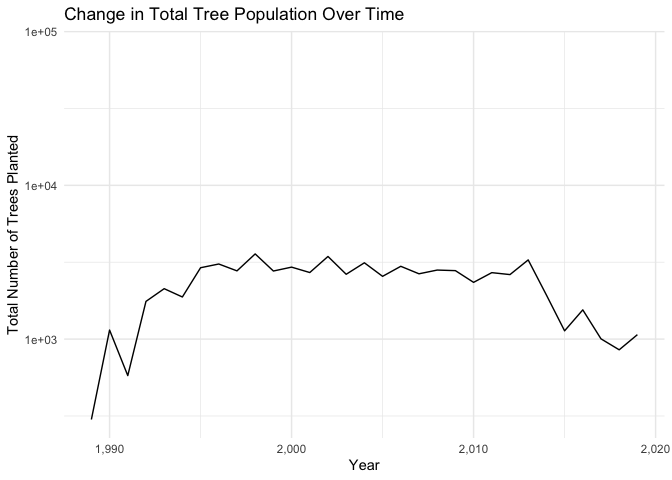

Mini Data Analysis Milestone 2
================

*To complete this milestone, you can either edit [this `.rmd`
file](https://raw.githubusercontent.com/UBC-STAT/stat545.stat.ubc.ca/master/content/mini-project/mini-project-2.Rmd)
directly. Fill in the sections that are commented out with
`<!--- start your work here--->`. When you are done, make sure to knit
to an `.md` file by changing the output in the YAML header to
`github_document`, before submitting a tagged release on canvas.*

# Welcome to the rest of your mini data analysis project!

In Milestone 1, you explored your data. and came up with research
questions. This time, we will finish up our mini data analysis and
obtain results for your data by:

- Making summary tables and graphs
- Manipulating special data types in R: factors and/or dates and times.
- Fitting a model object to your data, and extract a result.
- Reading and writing data as separate files.

We will also explore more in depth the concept of *tidy data.*

**NOTE**: The main purpose of the mini data analysis is to integrate
what you learn in class in an analysis. Although each milestone provides
a framework for you to conduct your analysis, it’s possible that you
might find the instructions too rigid for your data set. If this is the
case, you may deviate from the instructions – just make sure you’re
demonstrating a wide range of tools and techniques taught in this class.

# Instructions

**To complete this milestone**, edit [this very `.Rmd`
file](https://raw.githubusercontent.com/UBC-STAT/stat545.stat.ubc.ca/master/content/mini-project/mini-project-2.Rmd)
directly. Fill in the sections that are tagged with
`<!--- start your work here--->`.

**To submit this milestone**, make sure to knit this `.Rmd` file to an
`.md` file by changing the YAML output settings from
`output: html_document` to `output: github_document`. Commit and push
all of your work to your mini-analysis GitHub repository, and tag a
release on GitHub. Then, submit a link to your tagged release on canvas.

**Points**: This milestone is worth 50 points: 45 for your analysis, and
5 for overall reproducibility, cleanliness, and coherence of the Github
submission.

**Research Questions**: In Milestone 1, you chose two research questions
to focus on. Wherever realistic, your work in this milestone should
relate to these research questions whenever we ask for justification
behind your work. In the case that some tasks in this milestone don’t
align well with one of your research questions, feel free to discuss
your results in the context of a different research question.

# Learning Objectives

By the end of this milestone, you should:

- Understand what *tidy* data is, and how to create it using `tidyr`.
- Generate a reproducible and clear report using R Markdown.
- Manipulating special data types in R: factors and/or dates and times.
- Fitting a model object to your data, and extract a result.
- Reading and writing data as separate files.

# Setup

Begin by loading your data and the tidyverse package below:

``` r
library(datateachr) # <- might contain the data you picked!
library(tidyverse)
```

# Task 1: Process and summarize your data

From milestone 1, you should have an idea of the basic structure of your
dataset (e.g. number of rows and columns, class types, etc.). Here, we
will start investigating your data more in-depth using various data
manipulation functions.

### 1.1 (1 point)

First, write out the 4 research questions you defined in milestone 1
were. This will guide your work through milestone 2:

<!-------------------------- Start your work below ---------------------------->

**Research Question 1:** How does the diameter of trees vary with the
corresponding latitude or longitude coordinates in the dataset?

**Research Question 2:** What is the relationship between the diameter
and their height_range_id in the dataset?

**Research Question 3:** Are certain tree species more prevalent in
specific neighborhoods of Vancouver? In other words, is there any
relationships between species_name and neighborhood_name?

**Research Question 4:** What is the change of tree population in
Vancouver changed over time? In other words, the change of amount of the
tree planted each year.
<!----------------------------------------------------------------------------->

Here, we will investigate your data using various data manipulation and
graphing functions.

### 1.2 (8 points)

Now, for each of your four research questions, choose one task from
options 1-4 (summarizing), and one other task from 4-8 (graphing). You
should have 2 tasks done for each research question (8 total). Make sure
it makes sense to do them! (e.g. don’t use a numerical variables for a
task that needs a categorical variable.). Comment on why each task helps
(or doesn’t!) answer the corresponding research question.

Ensure that the output of each operation is printed!

Also make sure that you’re using dplyr and ggplot2 rather than base R.
Outside of this project, you may find that you prefer using base R
functions for certain tasks, and that’s just fine! But part of this
project is for you to practice the tools we learned in class, which is
dplyr and ggplot2.

**Summarizing:**

1.  Compute the *range*, *mean*, and *two other summary statistics* of
    **one numerical variable** across the groups of **one categorical
    variable** from your data.
2.  Compute the number of observations for at least one of your
    categorical variables. Do not use the function `table()`!
3.  Create a categorical variable with 3 or more groups from an existing
    numerical variable. You can use this new variable in the other
    tasks! *An example: age in years into “child, teen, adult, senior”.*
4.  Compute the proportion and counts in each category of one
    categorical variable across the groups of another categorical
    variable from your data. Do not use the function `table()`!

**Graphing:**

6.  Create a graph of your choosing, make one of the axes logarithmic,
    and format the axes labels so that they are “pretty” or easier to
    read.
7.  Make a graph where it makes sense to customize the alpha
    transparency.

Using variables and/or tables you made in one of the “Summarizing”
tasks:

8.  Create a graph that has at least two geom layers.
9.  Create 3 histograms, with each histogram having different sized
    bins. Pick the “best” one and explain why it is the best.

Make sure it’s clear what research question you are doing each operation
for!

<!------------------------- Start your work below ----------------------------->

**Research Question 1:** How does the diameter of trees vary with the
corresponding latitude or longitude coordinates in the dataset?

**Task1** *(summarizing)* Create a categorical variable diameter size
with 4 groups (small, medium, large, other) from an existing numerical
variable.

``` r
vancouver_trees <- vancouver_trees %>%
  mutate(diameter_size = case_when(
    diameter < 10 ~ "small", 
    between(diameter, 10, 20) ~ "medium", 
    diameter > 20 ~ "large",
    TRUE ~ "other" 
  ))
glimpse(vancouver_trees)
```

    ## Rows: 146,611
    ## Columns: 21
    ## $ tree_id            <dbl> 149556, 149563, 149579, 149590, 149604, 149616, 149…
    ## $ civic_number       <dbl> 494, 450, 4994, 858, 5032, 585, 4909, 4925, 4969, 7…
    ## $ std_street         <chr> "W 58TH AV", "W 58TH AV", "WINDSOR ST", "E 39TH AV"…
    ## $ genus_name         <chr> "ULMUS", "ZELKOVA", "STYRAX", "FRAXINUS", "ACER", "…
    ## $ species_name       <chr> "AMERICANA", "SERRATA", "JAPONICA", "AMERICANA", "C…
    ## $ cultivar_name      <chr> "BRANDON", NA, NA, "AUTUMN APPLAUSE", NA, "CHANTICL…
    ## $ common_name        <chr> "BRANDON ELM", "JAPANESE ZELKOVA", "JAPANESE SNOWBE…
    ## $ assigned           <chr> "N", "N", "N", "Y", "N", "N", "N", "N", "N", "N", "…
    ## $ root_barrier       <chr> "N", "N", "N", "N", "N", "N", "N", "N", "N", "N", "…
    ## $ plant_area         <chr> "N", "N", "4", "4", "4", "B", "6", "6", "3", "3", "…
    ## $ on_street_block    <dbl> 400, 400, 4900, 800, 5000, 500, 4900, 4900, 4900, 7…
    ## $ on_street          <chr> "W 58TH AV", "W 58TH AV", "WINDSOR ST", "E 39TH AV"…
    ## $ neighbourhood_name <chr> "MARPOLE", "MARPOLE", "KENSINGTON-CEDAR COTTAGE", "…
    ## $ street_side_name   <chr> "EVEN", "EVEN", "EVEN", "EVEN", "EVEN", "ODD", "ODD…
    ## $ height_range_id    <dbl> 2, 4, 3, 4, 2, 2, 3, 3, 2, 2, 2, 5, 3, 2, 2, 2, 2, …
    ## $ diameter           <dbl> 10.00, 10.00, 4.00, 18.00, 9.00, 5.00, 15.00, 14.00…
    ## $ curb               <chr> "N", "N", "Y", "Y", "Y", "Y", "Y", "Y", "Y", "Y", "…
    ## $ date_planted       <date> 1999-01-13, 1996-05-31, 1993-11-22, 1996-04-29, 19…
    ## $ longitude          <dbl> -123.1161, -123.1147, -123.0846, -123.0870, -123.08…
    ## $ latitude           <dbl> 49.21776, 49.21776, 49.23938, 49.23469, 49.23894, 4…
    ## $ diameter_size      <chr> "medium", "medium", "small", "medium", "small", "sm…

**Task2** *(graphing)* Create a graph where one of the axes is
logarithmic, and format the axis labels to be “pretty.” Create a scatter
plot of tree diameter (y-axis) against latitude (x-axis) and a scatter
plot of tree diameter (y-axis) against longitude (x-axis).

``` r
ggplot(vancouver_trees, aes(x = latitude, y = diameter)) +
  geom_point() +
  labs(x = "latitude", y = "diameter") +
  theme_minimal()
```

    ## Warning: Removed 22771 rows containing missing values (`geom_point()`).

<!-- -->

``` r
ggplot(vancouver_trees, aes(x = longitude, y = diameter)) +
  geom_point() +
  labs(x = "longitude", y = "diameter") +
  theme_minimal()
```

    ## Warning: Removed 22771 rows containing missing values (`geom_point()`).

<!-- -->

**Research Question 2:** What is the relationship between the diameter
and their height_range_id in the dataset?

**Task1** *(summarizing)* Compute the *range*, *mean*, and *two other
summary statistics* of diameter across the groups of height_range_id
from the data.

``` r
data_summary<- vancouver_trees %>%
  group_by(height_range_id) %>%
  summarize(
    d_range = diff(range(diameter)),
    d_mean = mean(diameter),
    d_median = median(diameter),
    d_std = sd(diameter)
  )
print(data_summary)
```

    ## # A tibble: 11 × 5
    ##    height_range_id d_range d_mean d_median d_std
    ##              <dbl>   <dbl>  <dbl>    <dbl> <dbl>
    ##  1               0    55     5.41      3    8.11
    ##  2               1    86     3.92      3    2.28
    ##  3               2   435     8.38      7    5.99
    ##  4               3   141    14.6      13    7.60
    ##  5               4   316    16.6      15.5  7.03
    ##  6               5    98    22.8      22.5  7.16
    ##  7               6    99    27.3      27    7.11
    ##  8               7    72.5  30.8      30    7.46
    ##  9               8    96    33.3      33    8.27
    ## 10               9    65    34.8      35    9.69
    ## 11              10    47    34.1      39   15.3

**Task2** *(graphing)* Make a graph where it makes sense to customize
the alpha transparency.

``` r
filtered_dataset <- vancouver_trees %>%
  filter(diameter > 0)

# Create a density plot for diameter versus height_range_id
ggplot(data = filtered_dataset, aes(x = diameter)) +
  geom_density(aes(fill = factor(height_range_id)), alpha = 0.5) +
  scale_x_log10() +
  labs(
    title = "Density of diameter for different height range",
    x = "Tree diameter",
    y = "Density"
  ) +
  theme_minimal()
```

<!-- -->

**Research Question 3:** Are certain tree species more prevalent in
specific neighborhoods of Vancouver? In other words, is there any
relationships between species_name and neighborhood_name?

**Task1** *(summarizing)* Compute the proportion and counts in each
category of neighbourhood_name across the groups of species_name from
the dataset

``` r
species_in_neighborhood <- vancouver_trees %>%
  count(neighbourhood_name, species_name) %>%
  group_by(neighbourhood_name) %>%
  mutate(total_count = sum(n),proportion = n / total_count) %>%
  ungroup()

head(species_in_neighborhood)
```

    ## # A tibble: 6 × 5
    ##   neighbourhood_name species_name       n total_count proportion
    ##   <chr>              <chr>          <int>       <int>      <dbl>
    ## 1 ARBUTUS-RIDGE      ABIES              2        5169   0.000387
    ## 2 ARBUTUS-RIDGE      ACERIFOLIA   X   103        5169   0.0199  
    ## 3 ARBUTUS-RIDGE      ACUTISSIMA         5        5169   0.000967
    ## 4 ARBUTUS-RIDGE      ALNIFOLIA         16        5169   0.00310 
    ## 5 ARBUTUS-RIDGE      AMERICANA        225        5169   0.0435  
    ## 6 ARBUTUS-RIDGE      AQUIFOLIUM         3        5169   0.000580

``` r
most_popular_species <- species_in_neighborhood %>%
  group_by(neighbourhood_name) %>%
  slice_max(order_by = proportion)

 # in order to see the full tibble
options(dplyr.print_min = 100) 
print(most_popular_species)
```

    ## # A tibble: 22 × 5
    ## # Groups:   neighbourhood_name [22]
    ##    neighbourhood_name       species_name     n total_count proportion
    ##    <chr>                    <chr>        <int>       <int>      <dbl>
    ##  1 ARBUTUS-RIDGE            CERASIFERA     895        5169     0.173 
    ##  2 DOWNTOWN                 RUBRUM        1019        5159     0.198 
    ##  3 DUNBAR-SOUTHLANDS        PLATANOIDES   1165        9415     0.124 
    ##  4 FAIRVIEW                 RUBRUM         567        4002     0.142 
    ##  5 GRANDVIEW-WOODLAND       SERRULATA      583        6703     0.0870
    ##  6 HASTINGS-SUNRISE         CERASIFERA     972       10547     0.0922
    ##  7 KENSINGTON-CEDAR COTTAGE SERRULATA     1002       11042     0.0907
    ##  8 KERRISDALE               PLATANOIDES   1067        6936     0.154 
    ##  9 KILLARNEY                EUCHLORA   X   676        6148     0.110 
    ## 10 KITSILANO                PLATANOIDES   1188        8115     0.146 
    ## 11 MARPOLE                  SERRULATA      799        6353     0.126 
    ## 12 MOUNT PLEASANT           SERRULATA      948        6292     0.151 
    ## 13 OAKRIDGE                 SERRULATA      726        4796     0.151 
    ## 14 RENFREW-COLLINGWOOD      SERRULATA      980       11386     0.0861
    ## 15 RILEY PARK               SERRULATA      822        6870     0.120 
    ## 16 SHAUGHNESSY              PLATANOIDES   1139        7009     0.163 
    ## 17 SOUTH CAMBIE             SERRULATA      329        3343     0.0984
    ## 18 STRATHCONA               SYLVATICA      247        2724     0.0907
    ## 19 SUNSET                   CERASIFERA     928        8367     0.111 
    ## 20 VICTORIA-FRASERVIEW      CERASIFERA    1241        7789     0.159 
    ## 21 WEST END                 SERRULATA      385        3507     0.110 
    ## 22 WEST POINT GREY          PLATANOIDES    700        4939     0.142

**Task2** *(graphing)* Create a graph of the most prevalent tree species
in each neighborhood , made x-axis logarithmic, and formatted the axes
labels

``` r
ggplot(most_popular_species, aes(x = proportion, y = reorder(neighbourhood_name, -proportion), fill = species_name)) +
  geom_bar(stat = "identity") +
  theme_minimal() +
  labs(
    title = "Most Prevalent Tree Species in Each Neighborhood",
    x = "Proportion",
    y = "Neighborhood name",
    fill = "Species name"
  ) + scale_x_continuous(labels = scales::percent_format(scale = 1))
```

<!-- -->

**Research Question 4:** What is the change of tree population in
Vancouver changed over time? In other words, the change of amount of the
tree planted each year.

Since the two variables in this research questions are date_planted and
total number of trees, it is quite difficult to choose one summary task
since all four somehoow relates to categorical variable. In order to
make the data analysis close to my research question, I chose to create
a categorical variable year_range with 4 groups from the date variable
based on extracting the year information from the date variable instead
of a numerical variable.

``` r
vancouver_trees <- vancouver_trees %>%
  #split year into 4 categories
  mutate(year_range = case_when( 
    year(date_planted) < 2000 ~ "Before 2000",
    year(date_planted) >= 2000 & year(date_planted) <= 2010 ~ "2000-2010",
    year(date_planted) > 2010 & year(date_planted) <= 2020 ~ "2010-2020",
    TRUE ~ "After 2020"
  ))
glimpse(vancouver_trees)
```

    ## Rows: 146,611
    ## Columns: 22
    ## $ tree_id            <dbl> 149556, 149563, 149579, 149590, 149604, 149616, 149…
    ## $ civic_number       <dbl> 494, 450, 4994, 858, 5032, 585, 4909, 4925, 4969, 7…
    ## $ std_street         <chr> "W 58TH AV", "W 58TH AV", "WINDSOR ST", "E 39TH AV"…
    ## $ genus_name         <chr> "ULMUS", "ZELKOVA", "STYRAX", "FRAXINUS", "ACER", "…
    ## $ species_name       <chr> "AMERICANA", "SERRATA", "JAPONICA", "AMERICANA", "C…
    ## $ cultivar_name      <chr> "BRANDON", NA, NA, "AUTUMN APPLAUSE", NA, "CHANTICL…
    ## $ common_name        <chr> "BRANDON ELM", "JAPANESE ZELKOVA", "JAPANESE SNOWBE…
    ## $ assigned           <chr> "N", "N", "N", "Y", "N", "N", "N", "N", "N", "N", "…
    ## $ root_barrier       <chr> "N", "N", "N", "N", "N", "N", "N", "N", "N", "N", "…
    ## $ plant_area         <chr> "N", "N", "4", "4", "4", "B", "6", "6", "3", "3", "…
    ## $ on_street_block    <dbl> 400, 400, 4900, 800, 5000, 500, 4900, 4900, 4900, 7…
    ## $ on_street          <chr> "W 58TH AV", "W 58TH AV", "WINDSOR ST", "E 39TH AV"…
    ## $ neighbourhood_name <chr> "MARPOLE", "MARPOLE", "KENSINGTON-CEDAR COTTAGE", "…
    ## $ street_side_name   <chr> "EVEN", "EVEN", "EVEN", "EVEN", "EVEN", "ODD", "ODD…
    ## $ height_range_id    <dbl> 2, 4, 3, 4, 2, 2, 3, 3, 2, 2, 2, 5, 3, 2, 2, 2, 2, …
    ## $ diameter           <dbl> 10.00, 10.00, 4.00, 18.00, 9.00, 5.00, 15.00, 14.00…
    ## $ curb               <chr> "N", "N", "Y", "Y", "Y", "Y", "Y", "Y", "Y", "Y", "…
    ## $ date_planted       <date> 1999-01-13, 1996-05-31, 1993-11-22, 1996-04-29, 19…
    ## $ longitude          <dbl> -123.1161, -123.1147, -123.0846, -123.0870, -123.08…
    ## $ latitude           <dbl> 49.21776, 49.21776, 49.23938, 49.23469, 49.23894, 4…
    ## $ diameter_size      <chr> "medium", "medium", "small", "medium", "small", "sm…
    ## $ year_range         <chr> "Before 2000", "Before 2000", "Before 2000", "Befor…

``` r
vancouver_trees <-vancouver_trees %>%
  mutate(year_planted = year(date_planted))

# group the data by year 
tree_counts_by_year <- vancouver_trees %>%
  group_by(year_planted) %>%
  
  #count the total number of trees planted each year
  summarise(total_tree_count = n()) %>%
  ungroup()
print(tree_counts_by_year)
```

    ## # A tibble: 32 × 2
    ##    year_planted total_tree_count
    ##           <dbl>            <int>
    ##  1         1989              300
    ##  2         1990             1145
    ##  3         1991              579
    ##  4         1992             1759
    ##  5         1993             2128
    ##  6         1994             1879
    ##  7         1995             2912
    ##  8         1996             3079
    ##  9         1997             2778
    ## 10         1998             3581
    ## 11         1999             2772
    ## 12         2000             2938
    ## 13         2001             2710
    ## 14         2002             3447
    ## 15         2003             2640
    ## 16         2004             3135
    ## 17         2005             2560
    ## 18         2006             2975
    ## 19         2007             2659
    ## 20         2008             2812
    ## 21         2009             2788
    ## 22         2010             2339
    ## 23         2011             2705
    ## 24         2012             2628
    ## 25         2013             3273
    ## 26         2014             1936
    ## 27         2015             1132
    ## 28         2016             1549
    ## 29         2017             1004
    ## 30         2018              852
    ## 31         2019             1069
    ## 32           NA            76548

**Task2** *(graphing)* Create a graph of the total Number of trees
planted over years, x-axes is made logarithmic(year), and format the
axes labels.

``` r
# Create a line plot to visualize the change in total tree population over years
ggplot(tree_counts_by_year, aes(x = year_planted, y = total_tree_count)) +
  geom_line() +
  scale_y_log10() +  # Set the y-axis to be logarithmic
  labs(
    title = "Change in Total Tree Population Over Time",
    x = "Year",
    y = "Total Number of Trees Planted"
  ) +
  theme_minimal() +
  scale_x_continuous(labels = scales::comma)  # Format x-axis labels
```

    ## Warning: Removed 1 row containing missing values (`geom_line()`).

<!-- -->
<!----------------------------------------------------------------------------->

### 1.3 (2 points)

Based on the operations that you’ve completed, how much closer are you
to answering your research questions? Think about what aspects of your
research questions remain unclear. Can your research questions be
refined, now that you’ve investigated your data a bit more? Which
research questions are yielding interesting results?

<!------------------------- Write your answer here ---------------------------->

Based on the above operations, I think my data analysis outputs relevant
results to all the research questions. However, some data analysis
results do not seem to be pretty useful. For example, the scatter plot
of Research Question 1 does not seem to yield pretty useful results in
terms of the relationship between tree diameter and the corresponding
latitude or longitude. Based on the generated graphs, there is no
obvious sign that certain longitude or latitude will largely affect the
diameter of the trees. But in my opinion, the question is in fact
interesting but no obvious relationship found between variables is a
normal scenario in data analysis. The process of analyzing and
processing the data is the most important thing.

On the other hand, Research Question 3 yielded interesting results, from
the generated plot, it is clear to see that each neighborhood has its
favorite tree species. For example, downtown favors Rubrum the most, the
proportion is almost 20% in the downtown area. Fairview also plants this
kind of tree the most, occupying about 14% of the trees in that
neighborhood. Also, Research Question 4 is yielding meaningful results.
I plotted the total amount of trees planted over the years. it is clear
to see from the plot that there is an increasing trend of tree planting
plans starting from around 1990 to 1995, after that, there’s no obvious
increasing trend anymore. Whereas starting from the year 2013, the total
amount of trees planted in Vancouver per year started to decrease.
Therefore, I think these data analysis results are useful in urban
planning, which indicates that the government should increase the total
amount of trees planted every year.

<!----------------------------------------------------------------------------->

# Task 2: Tidy your data

In this task, we will do several exercises to reshape our data. The goal
here is to understand how to do this reshaping with the `tidyr` package.

A reminder of the definition of *tidy* data:

- Each row is an **observation**
- Each column is a **variable**
- Each cell is a **value**

### 2.1 (2 points)

Based on the definition above, can you identify if your data is tidy or
untidy? Go through all your columns, or if you have \>8 variables, just
pick 8, and explain whether the data is untidy or tidy.

<!--------------------------- Start your work below --------------------------->
<!----------------------------------------------------------------------------->

### 2.2 (4 points)

Now, if your data is tidy, untidy it! Then, tidy it back to it’s
original state.

If your data is untidy, then tidy it! Then, untidy it back to it’s
original state.

Be sure to explain your reasoning for this task. Show us the “before”
and “after”.

<!--------------------------- Start your work below --------------------------->
<!----------------------------------------------------------------------------->

### 2.3 (4 points)

Now, you should be more familiar with your data, and also have made
progress in answering your research questions. Based on your interest,
and your analyses, pick 2 of the 4 research questions to continue your
analysis in the remaining tasks:

<!-------------------------- Start your work below ---------------------------->

1.  *FILL_THIS_IN*
2.  *FILL_THIS_IN*

<!----------------------------------------------------------------------------->

Explain your decision for choosing the above two research questions.

<!--------------------------- Start your work below --------------------------->
<!----------------------------------------------------------------------------->

Now, try to choose a version of your data that you think will be
appropriate to answer these 2 questions. Use between 4 and 8 functions
that we’ve covered so far (i.e. by filtering, cleaning, tidy’ing,
dropping irrelevant columns, etc.).

(If it makes more sense, then you can make/pick two versions of your
data, one for each research question.)

<!--------------------------- Start your work below --------------------------->

# Task 3: Modelling

## 3.0 (no points)

Pick a research question from 1.2, and pick a variable of interest
(we’ll call it “Y”) that’s relevant to the research question. Indicate
these.

<!-------------------------- Start your work below ---------------------------->

**Research Question**: FILL_THIS_IN

**Variable of interest**: FILL_THIS_IN

<!----------------------------------------------------------------------------->

## 3.1 (3 points)

Fit a model or run a hypothesis test that provides insight on this
variable with respect to the research question. Store the model object
as a variable, and print its output to screen. We’ll omit having to
justify your choice, because we don’t expect you to know about model
specifics in STAT 545.

- **Note**: It’s OK if you don’t know how these models/tests work. Here
  are some examples of things you can do here, but the sky’s the limit.

  - You could fit a model that makes predictions on Y using another
    variable, by using the `lm()` function.
  - You could test whether the mean of Y equals 0 using `t.test()`, or
    maybe the mean across two groups are different using `t.test()`, or
    maybe the mean across multiple groups are different using `anova()`
    (you may have to pivot your data for the latter two).
  - You could use `lm()` to test for significance of regression
    coefficients.

<!-------------------------- Start your work below ---------------------------->
<!----------------------------------------------------------------------------->

## 3.2 (3 points)

Produce something relevant from your fitted model: either predictions on
Y, or a single value like a regression coefficient or a p-value.

- Be sure to indicate in writing what you chose to produce.
- Your code should either output a tibble (in which case you should
  indicate the column that contains the thing you’re looking for), or
  the thing you’re looking for itself.
- Obtain your results using the `broom` package if possible. If your
  model is not compatible with the broom function you’re needing, then
  you can obtain your results by some other means, but first indicate
  which broom function is not compatible.

<!-------------------------- Start your work below ---------------------------->
<!----------------------------------------------------------------------------->

# Task 4: Reading and writing data

Get set up for this exercise by making a folder called `output` in the
top level of your project folder / repository. You’ll be saving things
there.

## 4.1 (3 points)

Take a summary table that you made from Task 1, and write it as a csv
file in your `output` folder. Use the `here::here()` function.

- **Robustness criteria**: You should be able to move your Mini Project
  repository / project folder to some other location on your computer,
  or move this very Rmd file to another location within your project
  repository / folder, and your code should still work.
- **Reproducibility criteria**: You should be able to delete the csv
  file, and remake it simply by knitting this Rmd file.

<!-------------------------- Start your work below ---------------------------->
<!----------------------------------------------------------------------------->

## 4.2 (3 points)

Write your model object from Task 3 to an R binary file (an RDS), and
load it again. Be sure to save the binary file in your `output` folder.
Use the functions `saveRDS()` and `readRDS()`.

- The same robustness and reproducibility criteria as in 4.1 apply here.

<!-------------------------- Start your work below ---------------------------->
<!----------------------------------------------------------------------------->

# Overall Reproducibility/Cleanliness/Coherence Checklist

Here are the criteria we’re looking for.

## Coherence (0.5 points)

The document should read sensibly from top to bottom, with no major
continuity errors.

The README file should still satisfy the criteria from the last
milestone, i.e. it has been updated to match the changes to the
repository made in this milestone.

## File and folder structure (1 points)

You should have at least three folders in the top level of your
repository: one for each milestone, and one output folder. If there are
any other folders, these are explained in the main README.

Each milestone document is contained in its respective folder, and
nowhere else.

Every level-1 folder (that is, the ones stored in the top level, like
“Milestone1” and “output”) has a `README` file, explaining in a sentence
or two what is in the folder, in plain language (it’s enough to say
something like “This folder contains the source for Milestone 1”).

## Output (1 point)

All output is recent and relevant:

- All Rmd files have been `knit`ted to their output md files.
- All knitted md files are viewable without errors on Github. Examples
  of errors: Missing plots, “Sorry about that, but we can’t show files
  that are this big right now” messages, error messages from broken R
  code
- All of these output files are up-to-date – that is, they haven’t
  fallen behind after the source (Rmd) files have been updated.
- There should be no relic output files. For example, if you were
  knitting an Rmd to html, but then changed the output to be only a
  markdown file, then the html file is a relic and should be deleted.

Our recommendation: delete all output files, and re-knit each
milestone’s Rmd file, so that everything is up to date and relevant.

## Tagged release (0.5 point)

You’ve tagged a release for Milestone 2.

### Attribution

Thanks to Victor Yuan for mostly putting this together.
